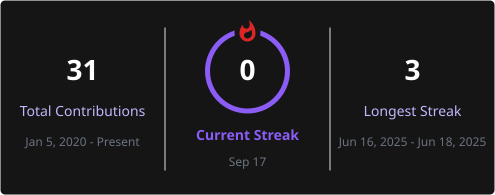
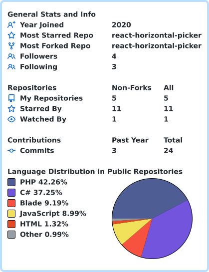

<div align="center">


<br><br>


</div>

---

## ☾ About Me

```text
┌──────────────────────────────────────────────────────────────┐
│                                                              │
│  MERT ÜLKÜ                                                   │
│  ─────────                                                   │
│                                                              │
│  Full-Stack Developer                                        │
│  Game Developer                                              │
│  Backend Engineer                                            │
│  System Builder                                              │
│                                                              │
│  I don't just write code.                                    │
│  I build systems, products and worlds.                       │
│                                                              │
└──────────────────────────────────────────────────────────────┘
```

I'm a self-taught developer who enjoys building things from the
ground up.

From web applications and APIs to game servers, launchers,
real-time systems and complete MMORPG ecosystems.

> **Ideas are cheap. Execution is everything.**

---

## ⚔️ The Arsenal

<div align="center">

### Languages


### Frameworks & Platforms


### Databases


### Infrastructure


</div>

---

## 🩸 Currently Forging

```text
╔══════════════════════════════════════════════════════════════╗
║                                                              ║
║  🎮 NEXARA ONLINE                                            ║
║                                                              ║
║  A dark MMORPG universe built from the ground up.            ║
║                                                              ║
║  Unity + C# + Laravel + MySQL + WebSockets                   ║
║                                                              ║
║  ▸ Character Systems                                         ║
║  ▸ Inventory & Equipment                                     ║
║  ▸ Skills & Combat                                           ║
║  ▸ Mob AI                                                    ║
║  ▸ Drop Systems                                               ║
║  ▸ Item Upgrade Systems                                      ║
║  ▸ Multiplayer Synchronization                               ║
║  ▸ Game Server                                                ║
║  ▸ Launcher                                                   ║
║  ▸ Management Panel                                          ║
║                                                              ║
╚══════════════════════════════════════════════════════════════╝
```

### 🎮 Nexara Online

Nexara Online is an MMORPG project combining classic MMORPG
mechanics with modern systems.

The goal isn't just to make a game.

The goal is to build an entire ecosystem.

```text
        CLIENT
          │
          ▼
    ┌─────────────┐
    │   GAME      │
    │   SERVER    │
    └──────┬──────┘
           │
     ┌─────┴─────┐
     ▼           ▼
  DATABASE    WEBSOCKET
     │           │
     └─────┬─────┘
           ▼
       WEB PANEL
           │
           ▼
       LAUNCHER
```

---

## 🧠 What I Build

```text
┌────────────────────┐
│ WEB APPLICATIONS   │
└────────────────────┘
          ↓
┌────────────────────┐
│ REST APIs          │
│ AUTH SYSTEMS       │
│ REAL-TIME SYSTEMS  │
└────────────────────┘
          ↓
┌────────────────────┐
│ GAME SERVERS       │
│ MULTIPLAYER        │
│ GAME SYSTEMS       │
└────────────────────┘
          ↓
┌────────────────────┐
│ INFRASTRUCTURE     │
│ DEPLOYMENT         │
│ SERVER MANAGEMENT  │
└────────────────────┘
```

---

## 🔥 Development Philosophy

```text
I don't believe in "I can't build it."

If I don't know something:

        I LEARN IT.

If it doesn't exist:

        I BUILD IT.

If it breaks:

        I FIX IT.

If it can be better:

        I REBUILD IT.
```

---

## 📊 The Realm

<div align="center">





</div>

---

## 🔥 The Streak

<div align="center">



</div>

---

## 🩸 Contribution

<div align="center">



</div>

---

## 🌑 Currently Learning

```text
Advanced Backend Architecture

[████████████████████████████████████████] 100%


Game Networking

[██████████████████████████████░░░░░░░░░░] 75%


Distributed Systems

[████████████████████████████░░░░░░░░░░░░] 70%


Advanced Unity Systems

[██████████████████████░░░░░░░░░░░░░░░░░░] 55%
```

---

## 💀 My Projects

<div align="center">

| Project | Description | Stack |
| :---: | :--- | :--- |
| 🎮 **Nexara Online** | MMORPG ecosystem | Unity · C# · Laravel |
| ⚙️ **Game Server** | Real-time multiplayer infrastructure | C# · WebSockets |
| 🌐 **Web Systems** | Full-stack applications | Laravel · React |
| 🛠️ **Developer Tools** | Custom tools & utilities | Python · Node.js |

</div>

---

## ⚡ Tech Stack

```text
PHP          ████████████████████
Laravel      ████████████████████
C#           ███████████████████░
Unity        ██████████████████░░
JavaScript   ██████████████████░░
React        ████████████████░░░░
Node.js      ███████████████░░░░░
MySQL        ████████████████████
Linux        ████████████████░░░░
Docker       ██████████████░░░░░░
```

---

## 🌑 Beyond The Code

```text
        ┌──────────────────────────────────────┐
        │                                      │
        │       BUILD     CREATE     DESTROY   │
        │                                      │
        │       Learn → Build → Break → Fix    │
        │                                      │
        │       Repeat until it's perfect.     │
        │                                      │
        └──────────────────────────────────────┘
```

I enjoy:

- 🎮 Game Development
- 🧠 System Architecture
- ⚙️ Backend Engineering
- 🌐 Full-Stack Development
- 🖥️ Infrastructure
- 🚀 Building products from scratch
- 🔬 Exploring how systems work

---

## ☠️ The Rule

<div align="center">

### **"The only limit is the one you accept."**

```text
              ⚔
           ╱     ╲
          ╱       ╲
         ╱  BUILD  ╲
        ╱           ╲
       ╱   CREATE    ╲
      ╱               ╲
     ╱_________________╲
```

</div>

---

## 🌐 Find Me

<div align="center">

<a href="https://github.com/mertulku134">

</a>

<a href="https://www.linkedin.com/in/mertulkku/">

</a>

<a href="mailto:YOUR_EMAIL@example.com">

</a>

</div>

---

<div align="center">


### ☾ THE DARKNESS NEVER STOPS BUILDING ☾

</div>
